# CV-APP

1. Bring up app
  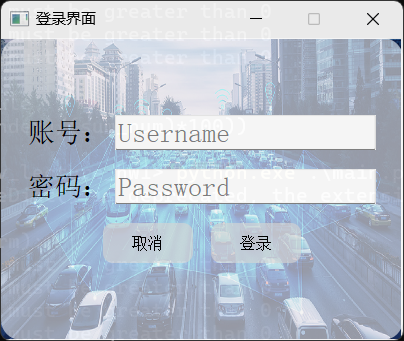
  account:PW
  password:1314
  After entering the password,the following interface is displayed

2. 从视频中获取每一帧

  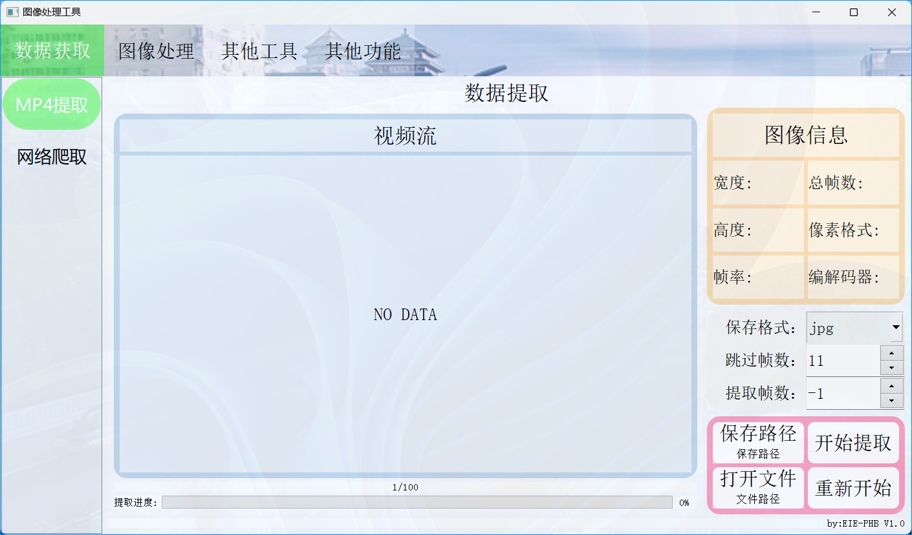

3. 从网上爬取图片数据

  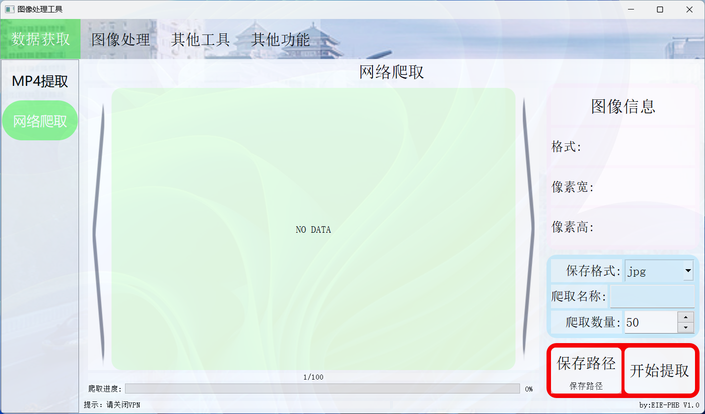

4. 格式转换

  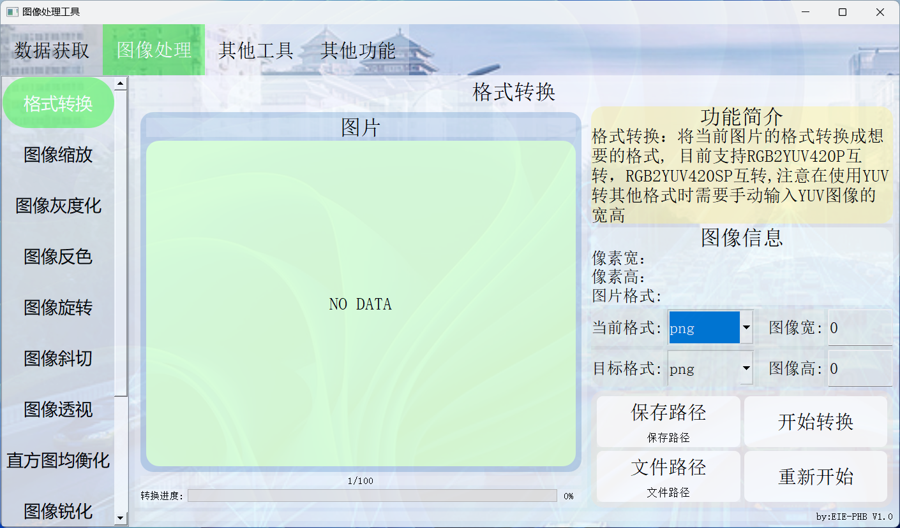

5. 图像缩放

  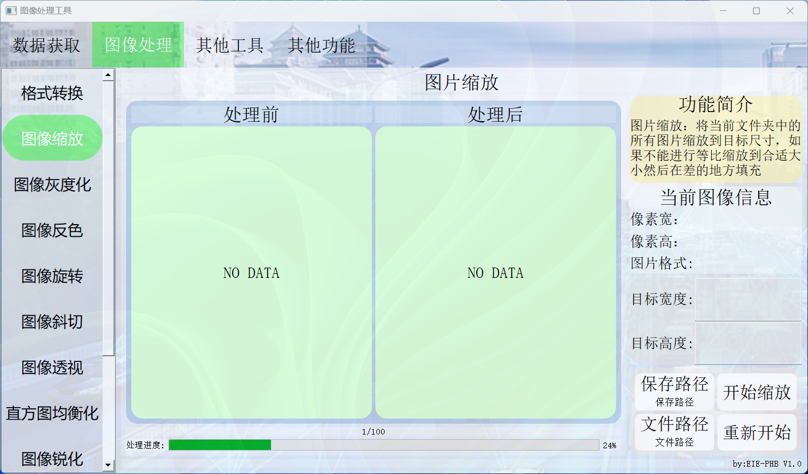

6. 图像灰度化

  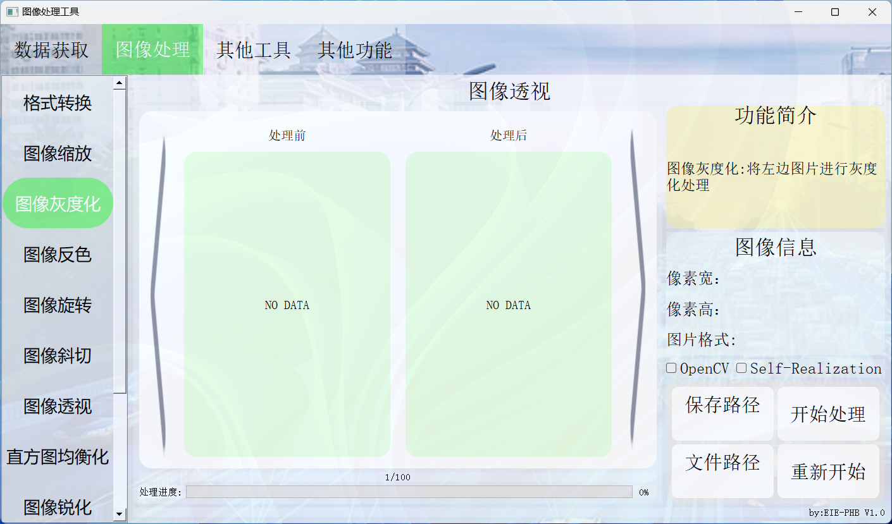

7. 图像反色

  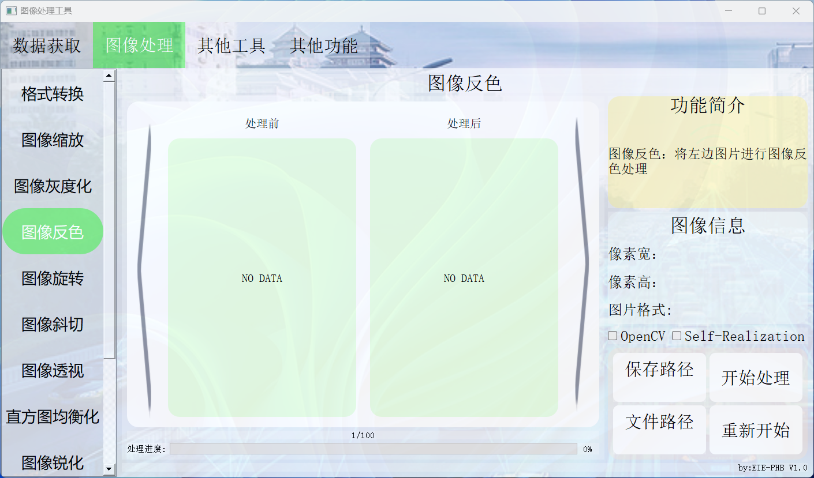

8. 图像旋转

  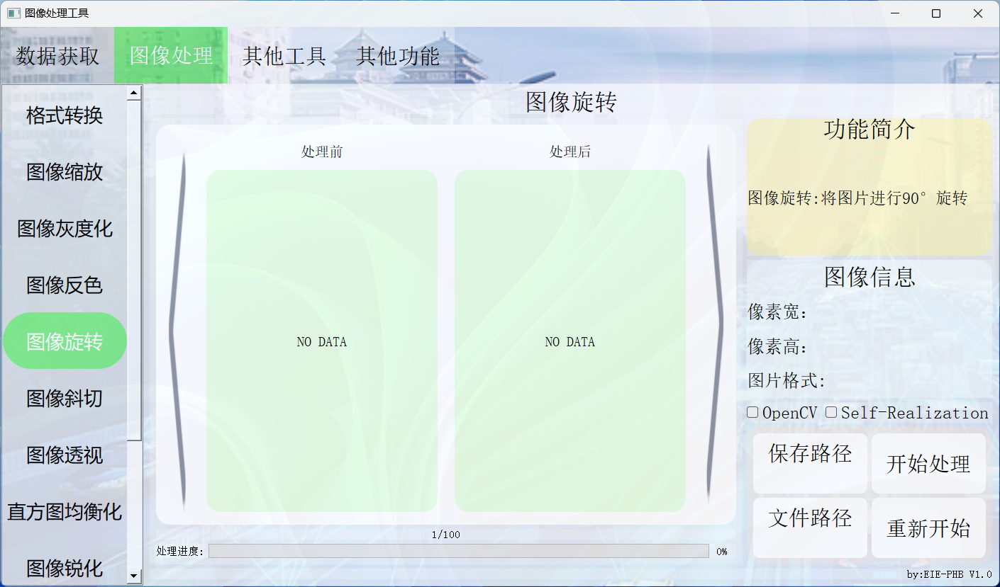

9. 图像斜切

  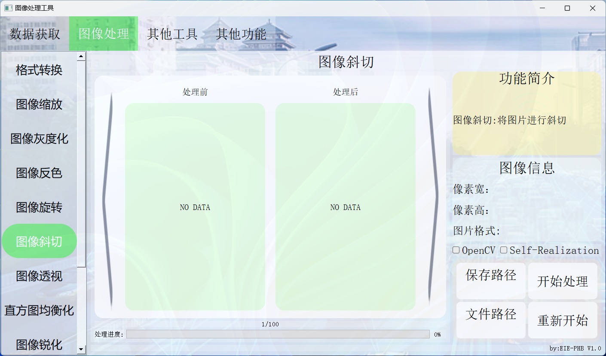

10. 图像透视

  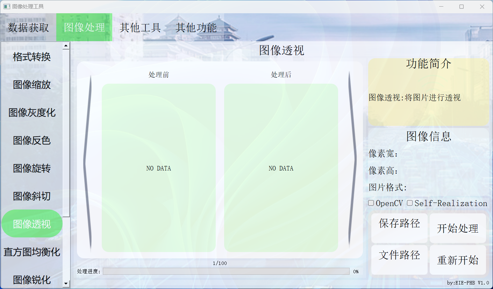

11. 直方图均衡化

   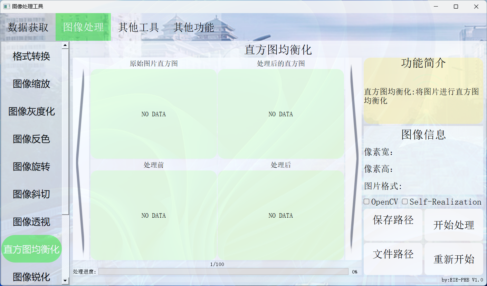

12. 图像锐化

   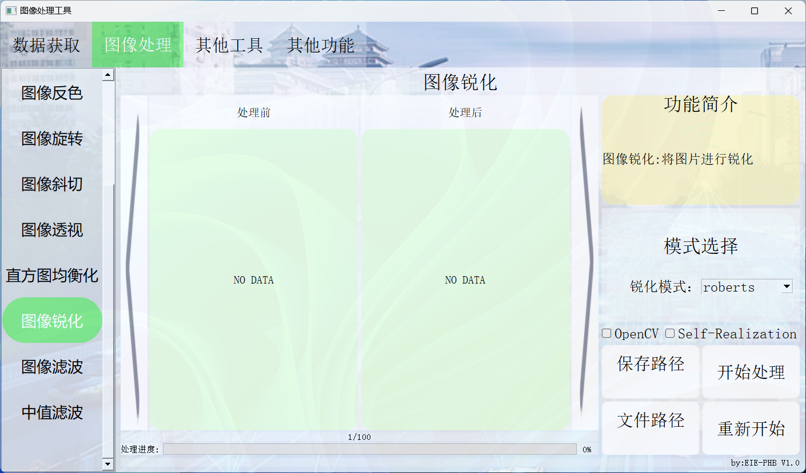

13. 图像滤波

   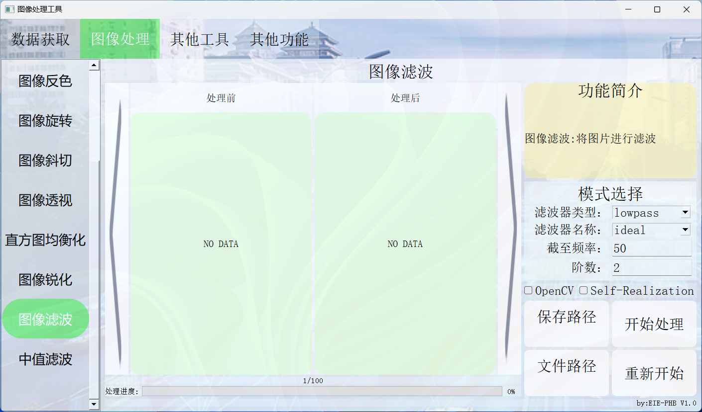

14. 中值滤波

   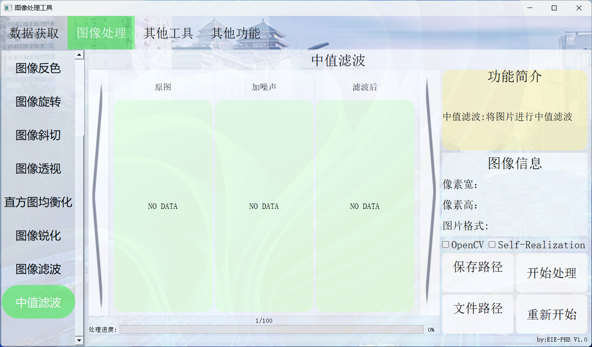

```bash
报如下错误：
COMLPTTest.py:24: DeprecationWarning: sipPyTypeDict() is deprecated, the extension module should use sipPyTypeDictRef() instead
  class Ui_COMLPTTest(QWidget):
qt.qpa.plugin: Could not load the Qt platform plugin "xcb" in "" even though it was found.
This application failed to start because no Qt platform plugin could be initialized. Reinstalling the application may fix this problem.
 
Available platform plugins are: eglfs, linuxfb, minimal, minimalegl, offscreen, vnc, wayland-egl, wayland, wayland-xcomposite-egl, wayland-xcomposite-glx, webgl, xcb.
 
已放弃
修订方法:

pip install --upgrade sip
pip install --upgrade PyQt5==5.11.3 -i https://pypi.tuna.tsinghua.edu.cn/simple
或者
pip3 install --upgrade PyQt5==5.11.3 -i https://pypi.tuna.tsinghua.edu.cn/simple
                        
原文链接：https://blog.csdn.net/u013934107/article/details/135648672